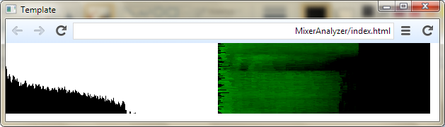

#Mixer Analyzer
**Mixer Analyzer** is a program, which can visualize your sound from some audio input devices, connected to your soundcard.

It uses [node-webkit](https://github.com/rogerwang/node-webkit)

Try it and enjoy!
